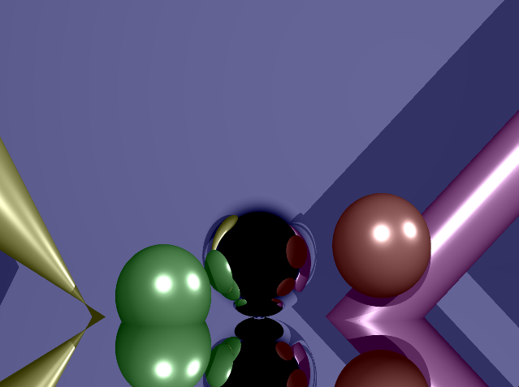
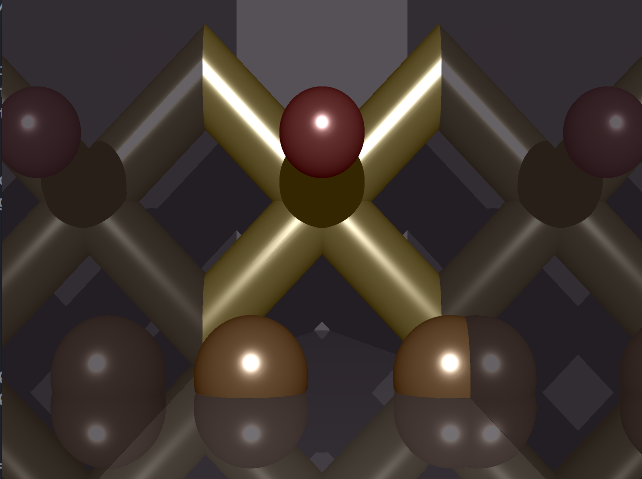
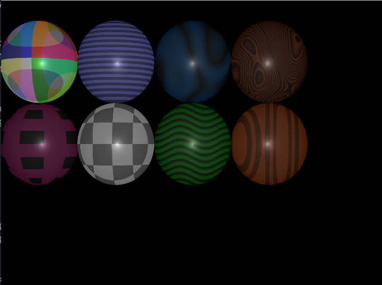
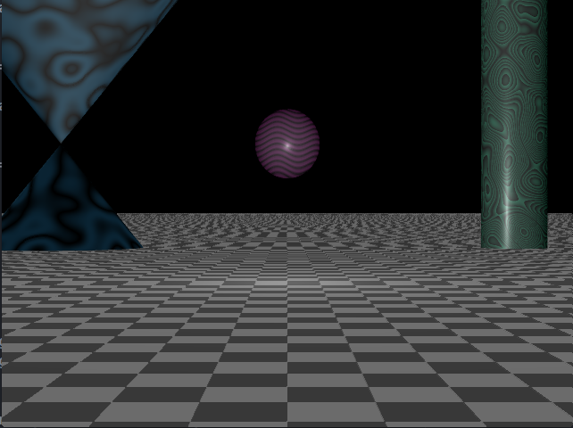
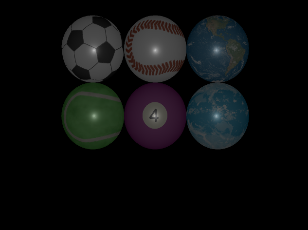
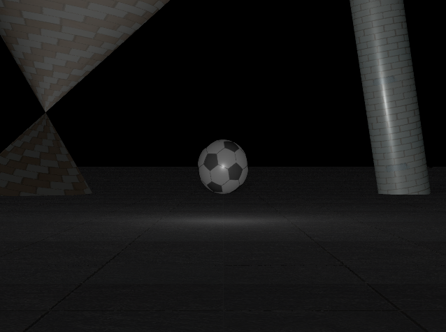
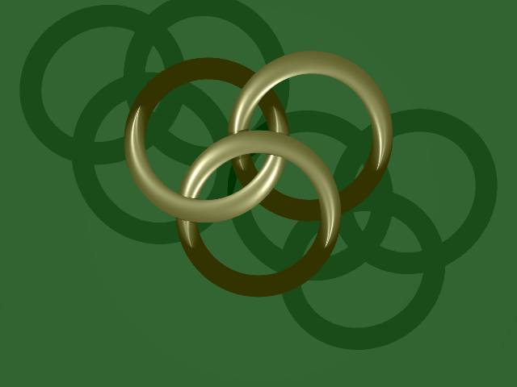
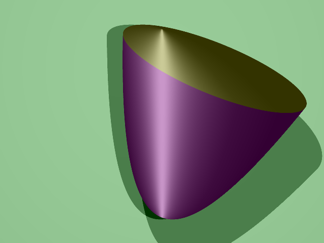
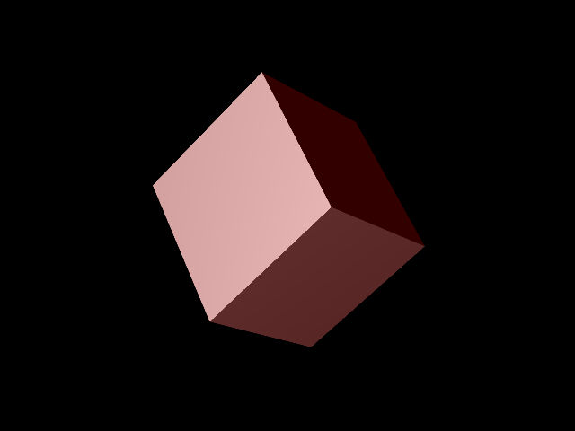
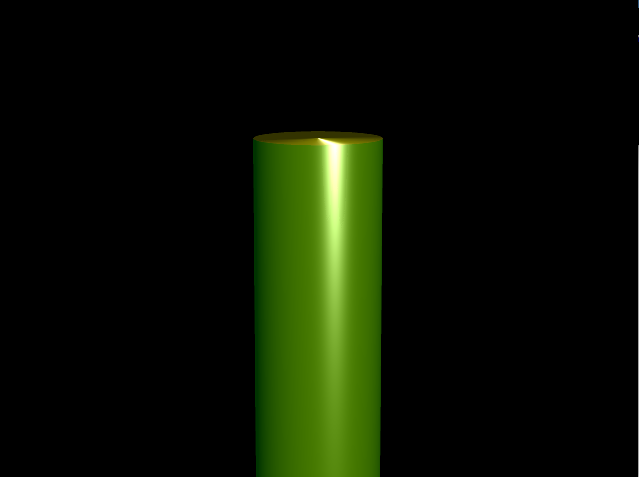

# RT
4th project of [42 School](https://www.42.fr) Computer Graphics Branch.

This project was completed by a team of 4 students.

## Description

The goal of this project is to generate images using the RayTracing method.

Theses computer generated images represents a scene. This scene is viewed from a specific position and a specific angle,  defined by simple geometric objects and has a lighting system.

## Features

- Basic raytracer : 4 objects (sphere, cylinder, cone, plane), lightning, multi-sport, shining, shading
- Parallel lightning
- Reflexion (the % of reflexion can be modified in the config file)
- Composed objects : a cube
- Native objects: ellipse, hyperboloid
- Limited objets: basic slicing, rotation, unique slicing method for each object
- Exotic objects: torus
- UI environment : simple interface, live modifications, auto-generate scenes
- Options : config file, ambient light (can be modified in the config file)
- Textures : apply on 4 simple objects, scale, offset, use SDL_image library to upload files (.bmp, .jpg, .png...)
- Perturbations : checker, stripes, rainbow, woodgrains, wavy, squares, sparkle, Perlin noise variations (simple, marble, wood)
- Classical visual effect : antialiasing, sepia filter, black and white filter
- Technical visual effect : multithread, screenshot
- Other : video recording, music

## Usage

```
$> make
$> ./RT file/file.rt
```

## Keys

<table width="100%">
  <thead>
  <tr>
    <td width="40%" height="60px" align="center" cellpadding="0">
      <strong>Description</strong>
    </td>
    <td width="10%" align="center" cellpadding="0">
      <span style="width:70px">&nbsp;</span><strong>Key(s)</strong><span style="width:50px">&nbsp;</span>
    </td>
  </tr>
  </thead>
<tbody>
  <tr>
    <td valign="top" height="30px">Exit the program</td>
    <td valign="top" align="center"><kbd>&nbsp;esc&nbsp;</kbd></td>
  </tr>
    <td valign="top" height="30px">Sepia filter</td>
    <td valign="top" align="center"><kbd>&nbsp;s&nbsp;</kbd> <kbd>&nbsp;m&nbsp;</kbd></td>
  </tr>
  </tr>
    <td valign="top" height="30px">Black and White filter</td>
    <td valign="top" align="center"><kbd>&nbsp;n&nbsp;</kbd> <kbd>&nbsp;m&nbsp;</kbd></td>
  </tr>
    <td valign="top" height="30px">Change config file</td>
    <td valign="top" align="center">
      <kbd>&nbsp;1&nbsp;</kbd><kbd>&nbsp;2&nbsp;</kbd><kbd>&nbsp;3&nbsp;</kbd>            <kbd>&nbsp;4&nbsp;</kbd><kbd>&nbsp;5&nbsp;</kbd><kbd>&nbsp;6&nbsp;</kbd>
      <kbd>&nbsp;7&nbsp;</kbd><kbd>&nbsp;8&nbsp;</kbd><kbd>&nbsp;9&nbsp;</kbd>
    </td>
  </tr>
  </tr>
    <td valign="top" height="30px">Left click on the object : move along the X or Y axis by moving the mouse left/right up/down </td>
    <td align="center"></td>
  </tr>
  </tr>
    <td valign="top" height="30px">Left click on the object : scroll with the mouse wheel to move along the Z axis</td>
    <td align="center"></td>
  </tr>
  </tr>
    <td valign="top" height="30px">Right click and move the mouse to move the camera direction</td>
    <td align="center"></td>
  </tr>
  </tbody>
</table>

## Output examples

### Reflexion



### Color perturbations



### Textures



### Torre


### Hyperboloid


### Cube


### Limit object

