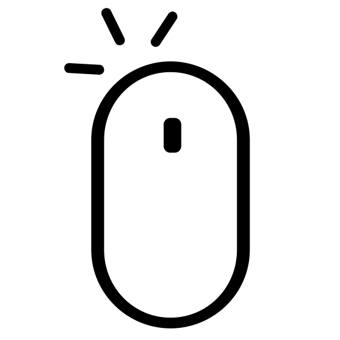
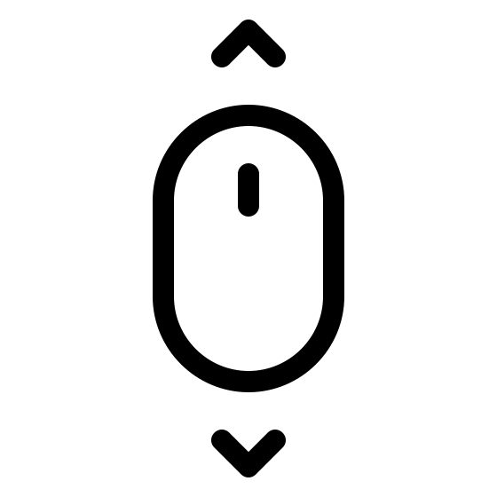
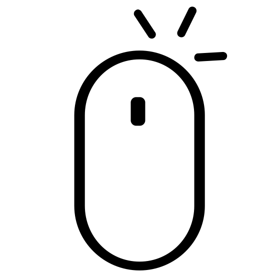

# RT
4e projet de la branche graphique du [cursus 42](https://www.42.fr).

Ce projet doit être complété par un groupe de 4 élèves.

## Description

L'objectif de ce projet est de générer des images de synthèse en se basant sur la méthode du Raytracing (lancer de rayon).

Ces images de synthèses représentent une scène. Cette dernière peut être observée depuis différent angles/positions, définie par des objets simples/complexes ainsi que d'un système de lumières.

## Options

- Raytracer classique : 4 objets (sphere, cylindre, cone, plan), lumière, multi-spot, brillance, ombre
- Lumière parallèle
- Reflexion (le % de réflexion peut être modifié dans le fichier de configuration)
- Objet composé : le cube
- Objets natifs: l'ellipse, la parabole
- Objets limités: découpe basique, rotation, découpe propre à chaque objets.
- Objets exotique: le torus
- Environnement UI : interface graphique simple, modification en temps réel, génération automatique des scènes
- Options : fichier de configuration, lmière ambiante (peut être modifié dans le fichier de configuration)
- Textures : Appliqué aux 4 objets simple, mise à l'échelle, offset, utilisation de la librairie SDL_image pour upload les fichiers (.bmp, .jpg, .png...)
- Perturbations : rayures, arc-en-ciel, woodgrains, ondulation, damier, variation du bruit de Perlin (simple, marbre, bois)
- Effet visuel classic : antialiasing, filtre sépia, filtre noir & blanc
- Effet visuel technique : multithread, screenshot intégré
- Autre : enregistrement vidéo intégré, musique

## Usage

```
$> make
$> ./RT file/file.rt
```

## Contrôles

<table width="100%">
  <thead>
  <tr>
    <td width="40%" height="60px" align="center" cellpadding="0">
      <strong>Description</strong>
    </td>
    <td width="10%" align="center" cellpadding="0">
      <span style="width:70px">&nbsp;</span><strong>Key(s)</strong><span style="width:50px">&nbsp;</span>
    </td>
  </tr>
  </thead>
<tbody>
  <tr>
    <td valign="top" height="30px">Quitter le programme</td>
    <td valign="top" align="center"><kbd>&nbsp;esc&nbsp;</kbd></td>
  </tr>
    <td valign="top" height="30px">Filtre Sepia</td>
    <td valign="top" align="center"><kbd>&nbsp;s&nbsp;</kbd> <kbd>&nbsp;m&nbsp;</kbd></td>
  </tr>
  </tr>
    <td valign="top" height="30px">Flitre noir & blanc</td>
    <td valign="top" align="center"><kbd>&nbsp;n&nbsp;</kbd> <kbd>&nbsp;m&nbsp;</kbd></td>
  </tr>
    <td valign="top" height="30px">Changer de fichier de configuration</td>
    <td valign="top" align="center">
      <kbd>&nbsp;1&nbsp;</kbd><kbd>&nbsp;2&nbsp;</kbd><kbd>&nbsp;3&nbsp;</kbd>            <kbd>&nbsp;4&nbsp;</kbd><kbd>&nbsp;5&nbsp;</kbd><kbd>&nbsp;6&nbsp;</kbd>
      <kbd>&nbsp;7&nbsp;</kbd><kbd>&nbsp;8&nbsp;</kbd><kbd>&nbsp;9&nbsp;</kbd>
    </td>
  </tr>
  </tr>
    <td valign="top" height="30px">Clic gauche sur un objet : déplacez l'axe X ou Y en déplacant la souris de gauche à droite & de haut en bas </td>
    <td align="center"></td>
  </tr>
  </tr>
    <td valign="top" height="30px">Clic droit sur un objet : utilisé la molette de soris pour faire varier l'axe Z </td>
    <td align="center"></td>
  </tr>
  </tr>
    <td valign="top" height="30px">Clic droit + mouvement de souris pour déplacer la direction de la caméra </td>
    <td align="center"></td>
  </tr>
  </tbody>
</table>

## Exemples imagés

### Reflexion


### Perturbation de couleurs


### Textures


### Torre


### Parabole


### Cube


### Objet limité

